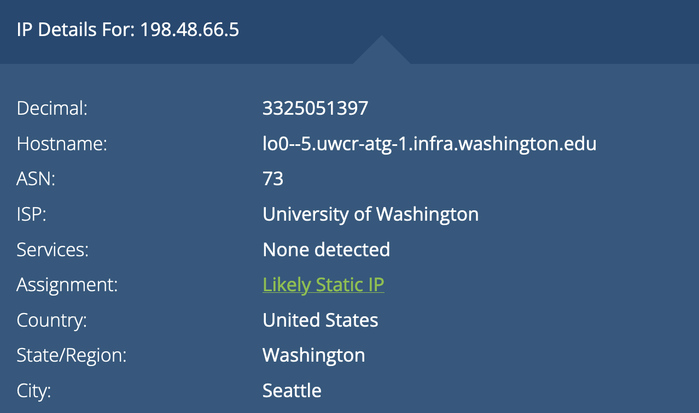

<!-- space for the script -->

## Use `tracert` (or `traceroute`, depending on your OS) on the following sites:
    www.amazon.com
    www.google.com
    www.microsoft.com

>What was the target server's IP address?

`www.amazon.com`
    
184.26.81.5

`www.google.com`

108.170.245.97

`www.microsoft.com`

 23.216.81.152

> How many hops were needed to reach the target?

`www.amazon.com`
    
11 hops

`www.google.com`

11 hops

`www.microsoft.com`

11 hops

> Can you identify your ISP from the intermediate server DNS names?

My ISP seems to be derivable from this DNS and IP: `lo0--5.uwcr-atg-1.infra.washington.edu (198.48.66.5)`. It seems that my second hop for all of the routes hits this point where it is a public IP address for the first time. 

According to `whatismyipaddress.com`, my ISP is the University of Washington which makes total sense as I am on the UW WiFi. 

> Identify the "class" of IP address for each major step in the trip

`www.amazon.com`

    1   10      Class A
    2   198     Class C
    3   10      Class A
    4   10      Class A
    5   10      Class A
    6   209     Class C
    7   198     Class C
    8   163     Class B
    9   162     Class B   
    10  23      Class A  
    11  184     Class B 

`www.google.com`

    1   10      Class A
    2   198     Class C
    3   10      Class A
    4   10      Class A
    5   10      Class A
    6   209     Class C
    7   74      Class A
    8   *       *
    9   209     Class C
    10  142     Class B
    11  108     Class A

`www.microsoft.com`

    1   10      Class A
    2   198     Class C
    3   10      Class A
    4   10      Class A
    5   10      Class A
    6   209     Class C
    7   206     Class C
    8   *       * 
    9   *       * 
    10  *       *
    11  23      Class A

---
## Terminal Output

`traceroute www.amazon.com`

    traceroute to e15316.dsca.akamaiedge.net (184.26.81.5), 64 hops max, 52 byte packets
    1  irb--2523.uwir-ads-1.infra.washington.edu (10.18.0.2)  6.054 ms  2.203 ms  2.132 ms
    2  lo0--5.uwcr-atg-1.infra.washington.edu (198.48.66.5)  3.487 ms  3.225 ms  3.666 ms
    3  ae4--1009.uwcr-atg-1.infra.washington.edu (10.132.5.75)  2.685 ms  3.533 ms  2.630 ms
    4  wi_nat_int.uwcf-atg-2.infra.washington.edu (10.132.255.21)  2.027 ms  1.961 ms  2.060 ms
    5  et-8-0-0--4080.uwcr-atg-1.infra.washington.edu (10.132.255.22)  2.350 ms  2.879 ms  2.692 ms
    6  ae20--4010.icar-sttl1-3.infra.pnw-gigapop.net (209.124.188.134)  3.140 ms  3.207 ms  3.253 ms
    7  hundredge-0-0-0-24.817.core1.seat.net.internet2.edu (198.71.47.5)  5.101 ms  5.881 ms  6.732 ms
    8  fourhundredge-0-0-0-48.4079.agg2.seat.net.internet2.edu (163.253.1.165)  5.449 ms
        fourhundredge-0-0-0-49.4079.agg2.seat.net.internet2.edu (163.253.1.167)  4.525 ms  5.675 ms
    9  162.252.69.123 (162.252.69.123)  5.099 ms  2.291 ms  3.153 ms
    10  ae4.sabey-sea2.netarch.akamai.com (23.203.145.159)  4.596 ms  5.730 ms  10.624 ms
    11  a184-26-81-5.deploy.static.akamaitechnologies.com (184.26.81.5)  2.539 ms  3.667 ms  3.211 ms

`traceroute www.google.com`

    traceroute to www.google.com (142.250.217.68), 64 hops max, 52 byte packets
    1  irb--2523.uwir-ads-1.infra.washington.edu (10.18.0.2)  3.580 ms  1.708 ms  2.402 ms
    2  lo0--5.uwcr-atg-1.infra.washington.edu (198.48.66.5)  2.123 ms  2.793 ms  2.125 ms
    3  ae4--1009.uwcr-atg-1.infra.washington.edu (10.132.5.75)  2.205 ms  2.744 ms  2.172 ms
    4  wi_nat_int.uwcf-atg-2.infra.washington.edu (10.132.255.21)  2.522 ms  3.888 ms  2.037 ms
    5  et-8-0-0--4080.uwcr-atg-1.infra.washington.edu (10.132.255.22)  2.645 ms  3.064 ms  3.253 ms
    6  ae20--4011.icar-sttl1-3.infra.pnw-gigapop.net (209.124.190.134)  3.250 ms  2.424 ms  5.331 ms
    7  74.125.51.244 (74.125.51.244)  3.811 ms  3.595 ms  2.792 ms
    8  * * *
    9  209.85.254.236 (209.85.254.236)  177.589 ms
        142.251.50.242 (142.251.50.242)  5.953 ms
        209.85.254.236 (209.85.254.236)  4.429 ms
    10  142.251.55.199 (142.251.55.199)  3.040 ms
        142.251.55.197 (142.251.55.197)  3.107 ms  2.670 ms
    11  108.170.245.97 (108.170.245.97)  4.420 ms
        sea09s29-in-f4.1e100.net (142.250.217.68)  2.726 ms
        108.170.245.97 (108.170.245.97)  3.850 ms

`traceroute www.microsoft.com`

    traceroute to e13678.dscb.akamaiedge.net (23.216.81.152), 64 hops max, 52 byte packets
    1  irb--2523.uwir-ads-1.infra.washington.edu (10.18.0.2)  3.487 ms  2.006 ms  2.104 ms
    2  lo0--5.uwcr-atg-1.infra.washington.edu (198.48.66.5)  2.473 ms  2.526 ms  13.315 ms
    3  ae4--1009.uwcr-atg-1.infra.washington.edu (10.132.5.75)  19.658 ms  2.873 ms  3.460 ms
    4  wi_nat_int.uwcf-atg-2.infra.washington.edu (10.132.255.21)  2.660 ms  2.762 ms  2.172 ms
    5  et-8-0-0--4080.uwcr-atg-1.infra.washington.edu (10.132.255.22)  2.927 ms  5.696 ms  3.098 ms
    6  ae20--4010.icar-sttl1-3.infra.pnw-gigapop.net (209.124.188.134)  2.663 ms  3.083 ms  6.241 ms
    7  six-sea2.netarch.akamai.com (206.81.80.168)  3.155 ms  3.980 ms  3.123 ms
    8  * * *
    9  * * *
    10  * * *
    11  a23-216-81-152.deploy.static.akamaitechnologies.com (23.216.81.152)  4.141 ms  2.418 ms  3.298 ms
